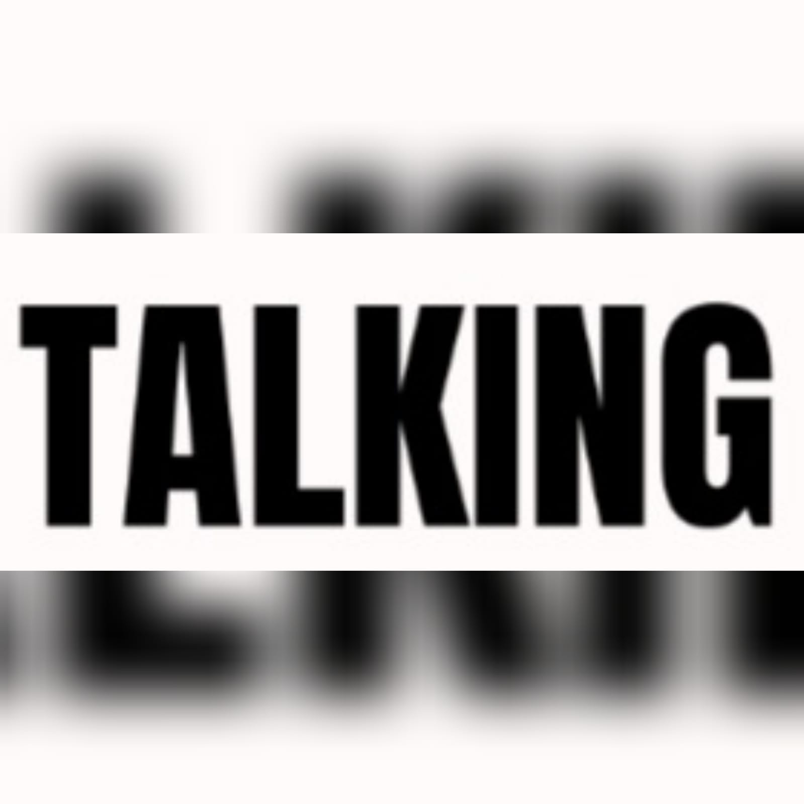

# programaciongrupo2
repogrupo2
 # Proyecto:  TALKING 

## Descripcion: 
El siguiente desarrollo de la web consta de la siguiente manera, es una red social que conecta personas del mundo para el aprendizaje a traves de idiomas en comun que quieran aprender. Se adicionan algunos cursos para poder afianzar el conocimiento oral-escrito 

## Uso: 
La siguiente web como mencionamos anteriormente es una red social para conectar con personas con un mismo interes "idiomas"esta se constituye de la siguiente manera: cinco secciones haciendo uso para el  maquetadado en HTML y CSS3 para los estilos.  la pagina principal es del loguin se accede al registrarse con usuario y contraseña, seccion de inicio, seccion de perfil, seccion de conocernos, seccion de cursos.  

## Instalacion: 

## Tecnologias Utlizadas:
 HTML5, CSS3, nose que mas........... 

## Capturas de Pantalla: 

## Contribucion: 

## Licencia: 

## Desarrolladores: 
## Arias Rodrigo, Benegas Lourdes, Garaycoechea Carolina, Rojas William. 

